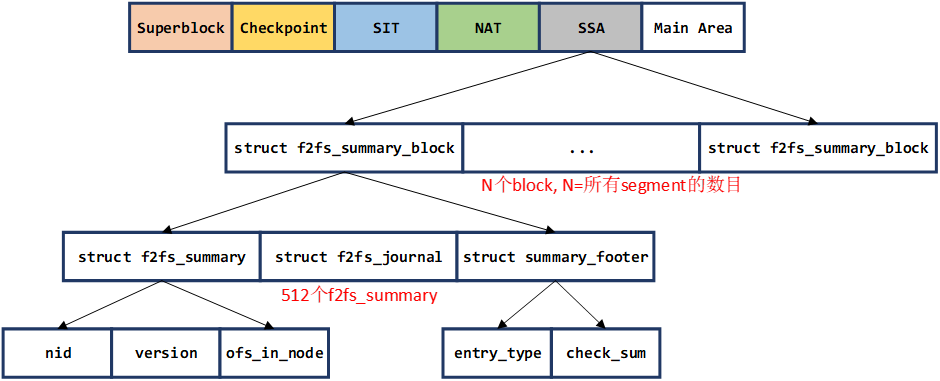

# Segment Summary Area区域-SSA结构
Segment Summary Area，简称SSA，是F2FS用于集中管理物理地址到逻辑地址的映射关系的结构，同时它也具有通过journal缓存sit或者nat的操作用于数据恢复的作用。映射关系的主要作用是当给出一个物理地址的时候，可以通过SSA索引得到对应的逻辑地址，主要应用在GC流程中; SSA所包含的journal可以缓存一些sit或者nat的操作，用于避免频繁的元数据更新，以及宕机时候的数据恢复。

## SSA在元数据区域的物理结构


从结构图可以知道，SSA区域由N个`struct f2fs_summary_block`组成，每一个`struct f2fs_summary_block`包含了512个`struct f2fs_summary_entry`，刚好对应一个segment。segment里面的每一个block(物理地址)对应一个的`struct f2fs_summary_entry`，它记录了物理地址到逻辑地址的映射信息。它包含了三个变量: nid(该物理地址是属于哪一个node的)，version(用于数据恢复)，ofs_in_node(该物理地址属于该nid对应的node的第ofs_in_node个block)。

`f2fs_journal`属于journal的信息，它的作用是减少频繁地对NAT区域以及SIT区域的更新。例如，当系统写压力很大的时候，segment bitmap更新就会很频繁，就会对到SIT章节所提到的`struct f2fs_sit_entry`结构进行频繁地改动。如果这个时候频繁将新的映射关系写入SIT，就会加重写压力。此时可以将数据先写入到journal中，因此journal的作用就是维护这些经常修改的数据，等待CP被触发的时候才写入磁盘，从而减少写压力。也许这里会有疑问，为什么将journal放在SSA区域而不是NAT区域以及SIT区域呢？这是因为这种存放方式可以减少元数据区域空间的占用。关于journal的描述以及作用可以参考[journal章节](https://github.com/RiweiPan/F2FS-NOTES/blob/master/ImportantDataStructure/f2fs_journal.md)以及[checkpoint章节](https://github.com/RiweiPan/F2FS-NOTES/blob/master/F2FS-Layout/Checkpoint%E7%BB%93%E6%9E%84.md)，本节不做描述。

### SSA物理存放区域结构

从上图所示，SSA的基本存放单元是`struct f2fs_summary_block`，它结构如下:

```c
struct f2fs_summary_block {
	struct f2fs_summary entries[ENTRIES_IN_SUM]; // ENTRIES_IN_SUM = 512
	struct f2fs_journal journal;
	struct summary_footer footer;
} __packed;
```

与summary直接相关的是`struct f2fs_summary`以及`struct summary_footer`。`ENTRIES_IN_SUM`的值512，因此每一个entry对应一个block，记录了从物理地址到逻辑地址的映射关系，entry的结构如下:

```c
struct f2fs_summary {
	__le32 nid;		/* parent node id */
	union {
		__u8 reserved[3];
		struct {
			__u8 version;		/* node version number */
			__le16 ofs_in_node;	/* block index in parent node */
		} __packed;
	};
} __packed;
```

用了一个union结构进行表示，但是核心信息是`nid`、`version`以及`ofs_in_node`。根据[文件数据的保存以及物理地址的映射](https://github.com/RiweiPan/F2FS-NOTES/blob/master/Reading-and-Writing/file_data_structure.md) 可以知道，数据的索引是通过node来进行。文件访问某一个页的数据时，需要首先根据页的索引，找到对应的nid以及offset(两者构成逻辑地址)，从而根据nid得到node page，再根据offset得到了该页的物理地址，然后从磁盘中读取出来。`f2fs_summary`则是记录物理地址到逻辑地址的映射，即根据物理地址找到对应的nid以及offset。例如，现在需要根据物理地址为624的block，找到对应的nid以及offset。那么物理地址为624，可以得到该地址位于第二个segment，然后属于第二个segment的第113个block(block的编址从0开始)。因此根据属于第二个segment的信息，找到第二个`struct f2fs_summary_block`，然后根据偏移量为113的信息，找到对应的`struct f2fs_summary`结构，从而得到`nid`以及`ofs_in_node`。


`struct summary_footer`结构记录了校验信息，以及这个summary对应的segment是属于保存data数据的segment还是node数据的segment。


## SSA内存管理结构
SSA在内存没有单独的管理结构，summary以及journal在内存中主要存在于`CURSEG`中，可以从[Checkpoint章节](https://github.com/RiweiPan/F2FS-NOTES/blob/master/F2FS-Data-Recovery/Checkpoint%E6%B5%81%E7%A8%8B.md)找到相关的描述。
